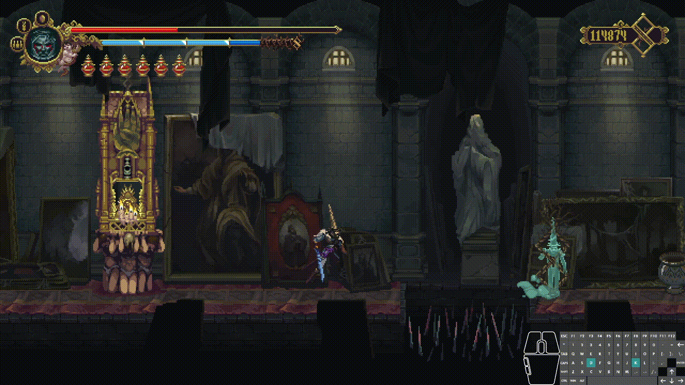
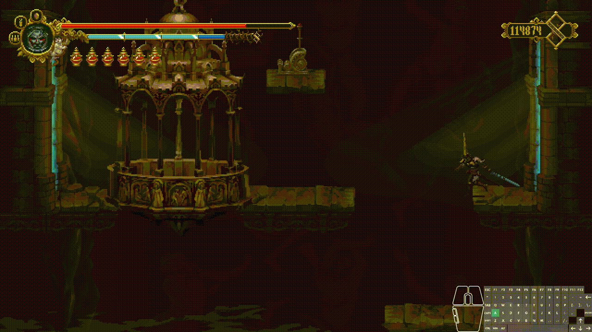

# Blasphemous: Forgiving Spikes

A Blasphemous 1 mod that makes spike, fall, and other trap penalty more forgiving. Highly customizable with other mods or by config.

---

## Features

 

- Make Penitent respawn after falling into spikes trap or abyss trap, instead of being instakilled. 
- Configurable functionalities, including
  - spike damage (fixed damage / percentage damage)
  - spike damage element & damage type
  - spike ignore defense or not
  - whether to revert to vanilla instakill mechanics
- Supports configurating both through `.cfg` file and public API access through `SpikeUtilities` static class

## Usage

`SpikePenaltyConfig` has the following configurable fields that you can change in `.cfg` file:

- `spikePenaltyType`: "Instakill", "FixedDamage" or "PercentageDamage"
- `spikeDamageAmount`:
  -  if `spikePenaltyType` is "FixedDamage", then its amount is fixed damage amount
  -  if `spikePenaltyType` is "PercentageDamage", then its amount is the ratio to Penitent's max health (range: [0.0, 1.0])
- `spikeDamageIgnoreDefense`: Whether to ignore defense or not 
  - (value: `true` / `false`)
- `spikeDamageElement`: Damage element of the spike
  - (value: `Normal` / `Fire` / `Toxic` / `Lightning` / `Magic`, `Contact`)
- `spikeDamageType`: Damage type of the spike
  - (value: `Normal` / `Heavy` / `Critical` / `Simple` / `Stunt` / `OptionalStunt`)

## Installation

This mod is available for download through the [Blasphemous Mod Installer](https://github.com/BrandenEK/Blasphemous.Modding.Installer)

Required dependencies (dependencies are auto-downloaded if installed through Mod Installer):
- [Modding API](https://github.com/BrandenEK/Blasphemous.ModdingAPI)
- [Cheat Console](https://github.com/brandenEK/Blasphemous.CheatConsole)